# 헬스장 회원 관리 및 회원 서비스 플랫폼 (관리자/회원)

- **개발 기간** : 2024/07/03 ~ 07/31

## 목차
1. [프로젝트 소개](#프로젝트소개)
2. [개발 환경](#개발환경)
3. [기술 스택](#기술스택)
4. [구현 화면](#구현화면)
 

## 프로젝트 소개

PHGYM은 효율적인 헬스장 운영을 위한 웹 기반 시스템입니다. 회원들이 헬스장을 보다 편리하게 이용할 수 있도록 하기 위해 웹페이지를 개발하였습니다. 회원들은 웹사이트를 통해 개인 계정에 접근하고, 스케줄을 관리하며, 다양한 헬스장 서비스에 쉽게 접근할 수 있습니다.

또한, 관리자는 관리자 모드를 통해 회원 정보를 효율적으로 관리하고, 각 담당 회원의 스케줄을 관리하여 보다 효과적인 결과를 도출할 수 있습니다. 이 시스템은 헬스장 운영의 효율성을 높이고, 회원들에게 최상의 서비스를 제공하는 것을 목표로 하고 있습니다.

 
  
## 개발환경

| 항목 | 내용 |
|---|---|
| **OS** | Windows 10 / macOS |
| **IDE** | Visual Studio Code / Eclipse |
| **Version Control** | GitHub |
| **Build Tool** | Maven / Gradle |
| **Database** | OracleDB |
| **Server** | Apache Tomcat |

## 기술스택

| 항목 | 내용 |
|---|---|
| **Frontend** | HTML5, CSS3, JavaScript (ES6), Bootstrap |
| **Backend** | Java (JDK 11), Eclipse(4.31.0) |
| **Database** | OracleDB |

 

## 팀원 구성

| **김수현** | **임혜주** | **신지윤** | **남상혁** | **최해찬** |
| :------: |  :------: | :------: | :------: | :------: |
| [   @suhyun-kim9](https://github.com/@suhyun-kim9) | [   @hyejux](https://github.com/@hyejux) | [   @jishin14](https://github.com/jishin14) | [   @sxxxhyuk](https://github.com/sxxxhyuk) | [   @whfh3832](https://github.com/whfh3832) |

 

## 프로젝트 구현 화면

### 로그인 화면
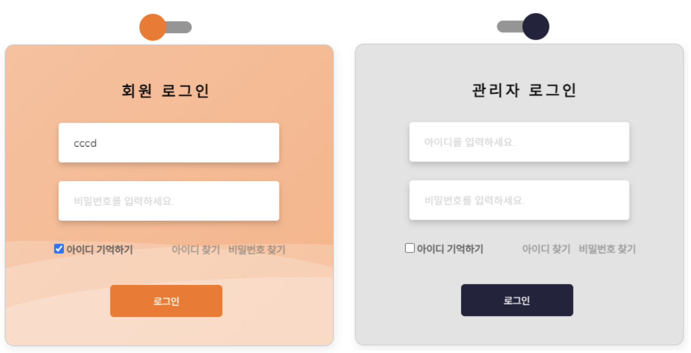
📍 사용자/관리자가 로그인할 수 있는 화면으로 토글로 모드를 전환할 수 있습니다.

### 대시보드 화면
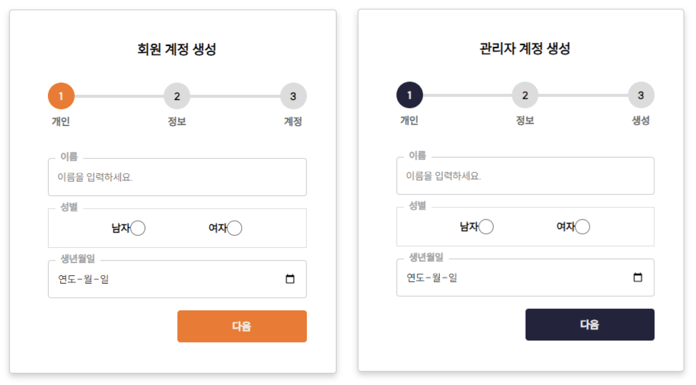
사용자/관리자가 회원가입할 수 있는 화면입니다.

### 메인 화면
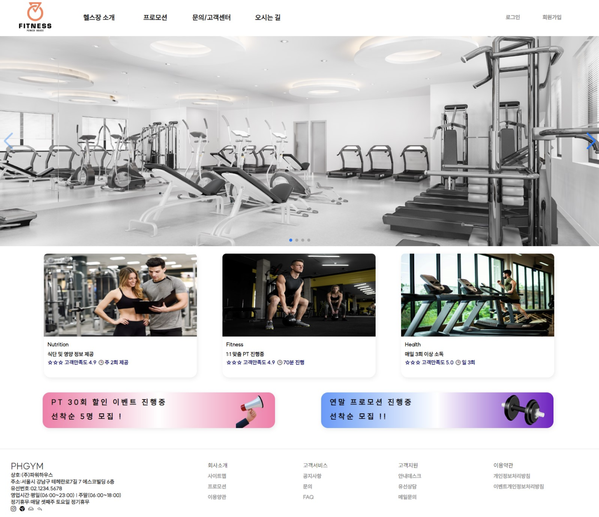
PHGYM의 메인 화면입니다.

### 트레이너 소개 및 예약 연동 화면
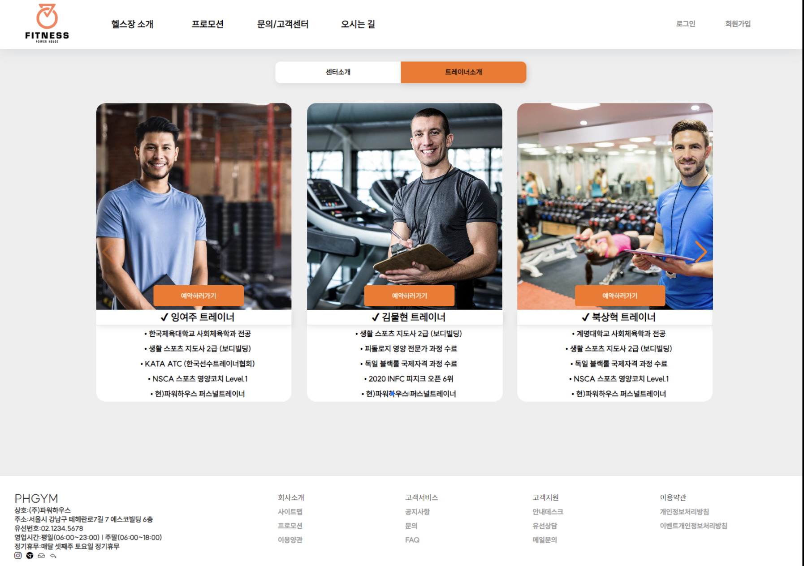
PHGYM의 트레이너 소개 및 예약 연동 화면입니다.

### 프로모션 안내 화면
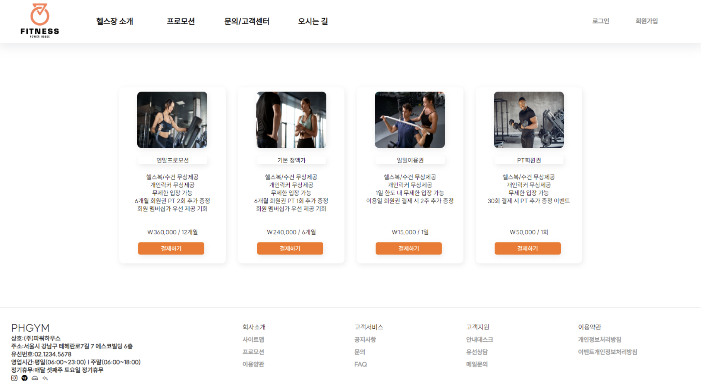
프로모션별 소개 및 예약 연동 화면입니다.

### 프로모션 결제 화면
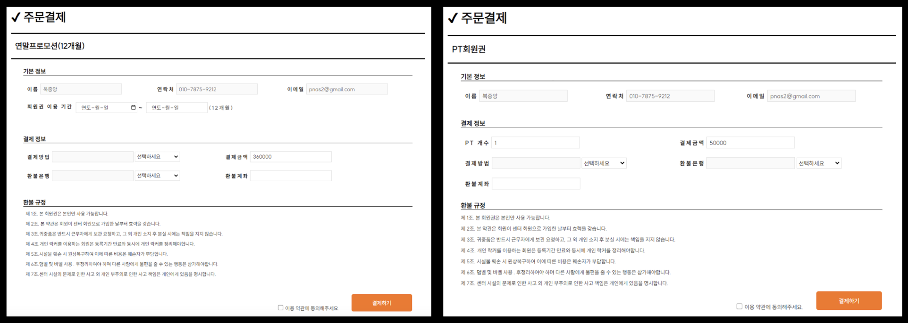
프로모션별 결제 화면입니다.

### 지도 화면
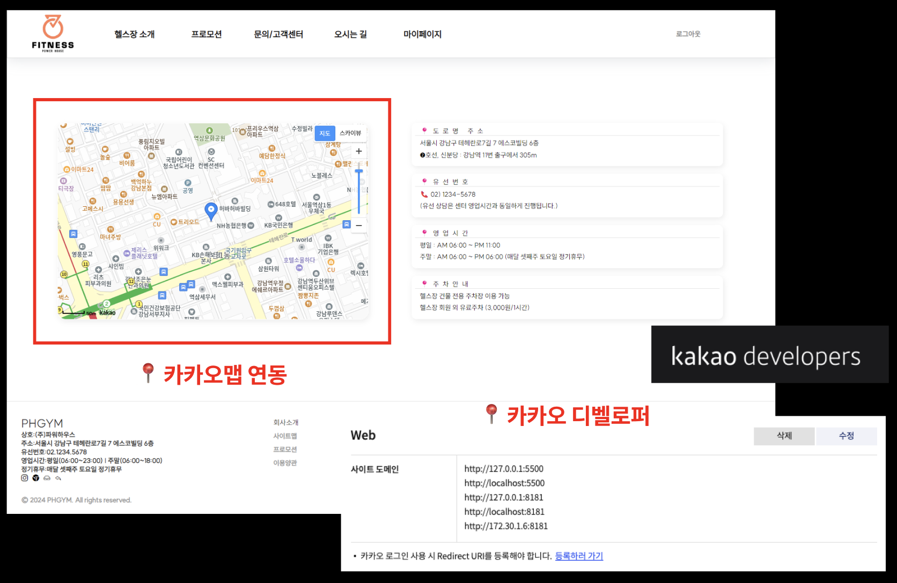
오시는길 소개로 카카오맵 api를 연동한 화면입니다.

### 에러 화면
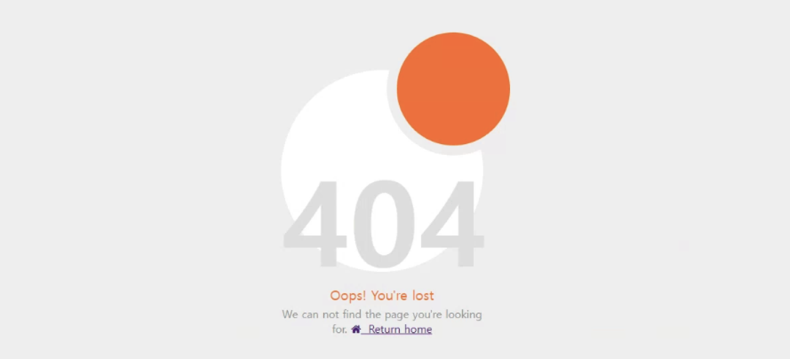
error 공통 화면입니다.

### 출석체크 화면(회원)
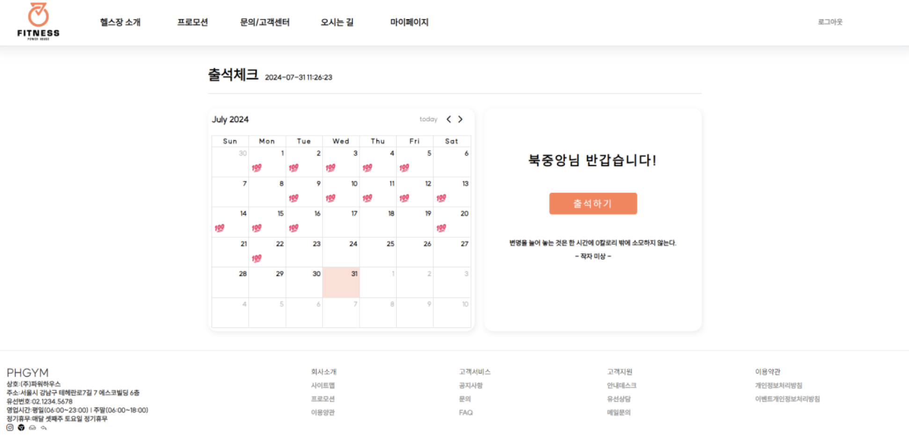
회원 헬스장 출석체크 화면입니다.

### PT예약 화면(회원)
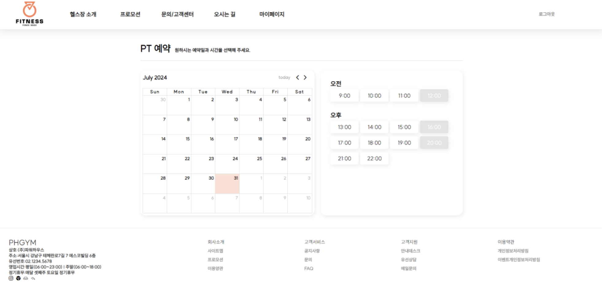
회원 PT 예약 화면입니다.

### PT회원권 양도 화면(회원)
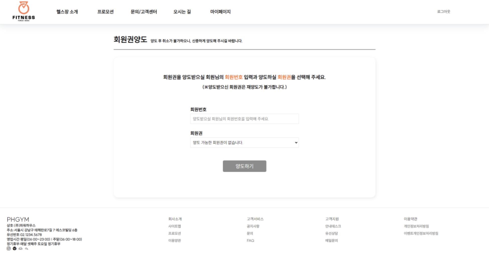
회원 PT회원권 양도 화면입니다.

### 게시판 화면
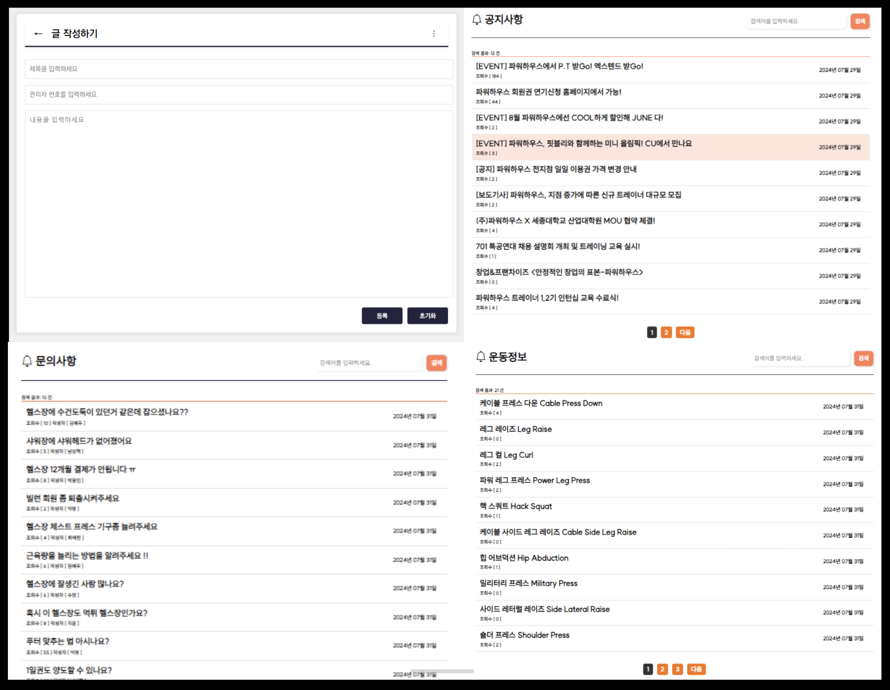
게시판 화면입니다.

### 관리자페이지 메인 화면(관리자)
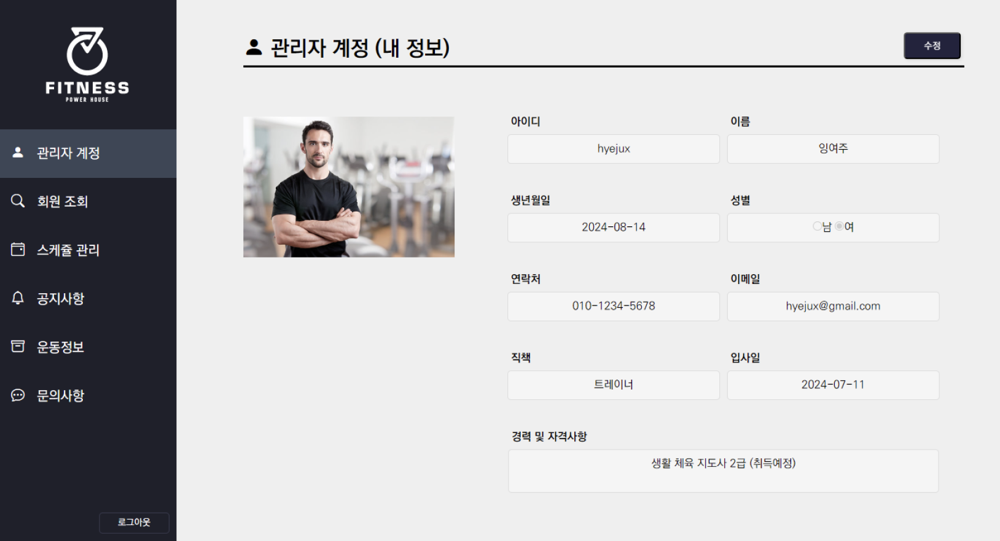
관리자페이지 메인 화면입니다.

### 회원PT 일정확인 화면(관리자)
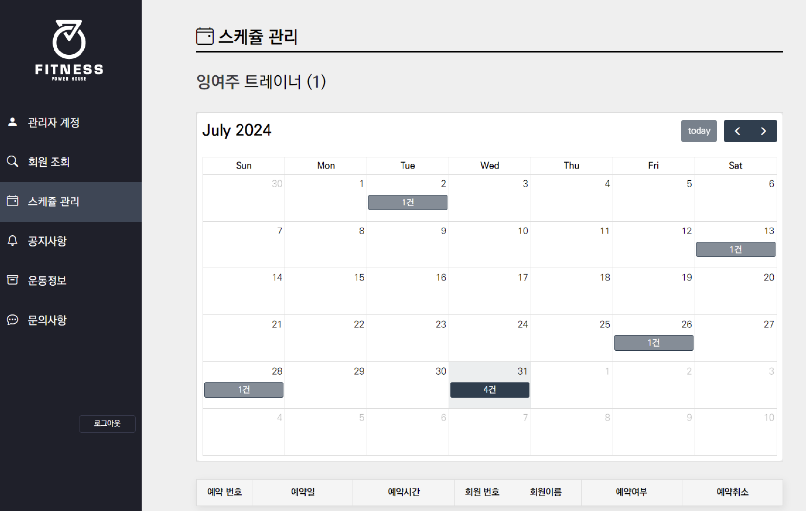
관리자별 담당 회원PT 일정확인 화면입니다.

### 회원정보확인 화면(관리자)
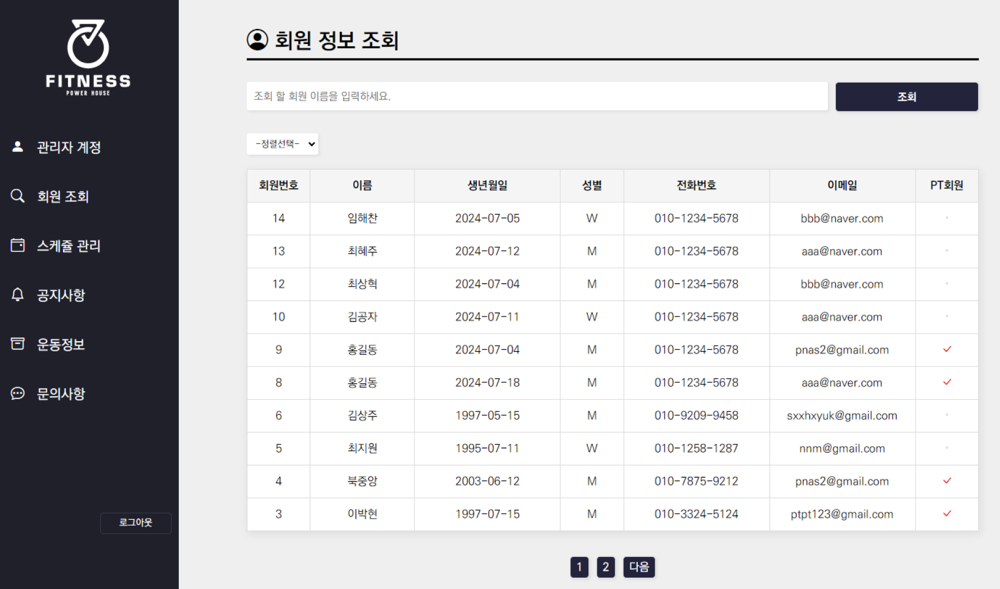
회원정보확인 화면입니다.

